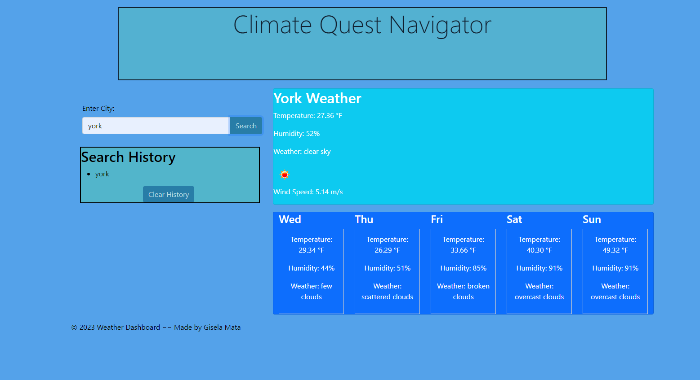

# Climate-Quest-Navigator
Never Fear! Weather predictions are here! On this app you can easily find the weather in a city near you!




## Introduction

Climate Quest Navigator is a weather dashboard that allows users to check the current weather and 5-day forecast for a specific city. It also keeps track of your search history of the past cities you have looked up.


## Features

- **Current Weather:** Get real-time information about temperature, humidity, weather description, and wind speed.

- **5-Day Forecast:** Plan ahead with a 5-day forecast organized by day.

- **Search History:** Keep track of past searches for quick reference.

- **Clear History:** Easily clear search history with the click of a button.


## Getting Started

To use Climate Quest Navigator:

1. Clone the repository:
   ```bash
   git clone https://github.com/your-username/climate-quest-navigator.git
2. Open index.html in your preferred web browser.


## Usage

- **Enter** the city name in the search bar.
- **Click** "Search."
- **View** current weather and 5-day forecast.
- **Search history** is displayed on the left. Click "Clear History" to remove all searches.


## Built With
- **HTML**
- **CSS**
- **JavaScript**
- **Bootstrap** - Front-end framework


## Contributing
Contributions are welcome! If you find a bug or have a feature request, please open an issue.